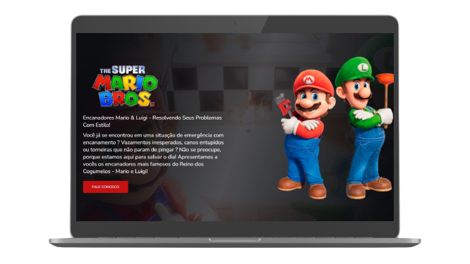

# 🍄 Super Mario Bros - Encanadores Mario & Luigi


> Página interativa inspirada nos icônicos personagens Mario e Luigi, oferecendo serviços de encanamento com estilo!

## 📖 Índice

- [🎮 Sobre o Projeto](#-sobre-o-projeto)
- [📺 Demonstração](#-demonstração)
- [🛠️ Tecnologias Utilizadas](#%EF%B8%8F-tecnologias-utilizadas)
- [⚙️ Como Rodar o Projeto](#%EF%B8%8F-como-rodar-o-projeto)
- [📂 Estrutura do Projeto](#-estrutura-do-projeto)
- [🤝 Contribuição](#-contribuição)
- [📝 Licença](#-licença)
- [📌 Contato](#-contato)

---

## 🎮 Sobre o Projeto

Este projeto é uma página interativa sobre os encanadores mais famosos do Reino dos Cogumelos: **Mario & Luigi**!  
A página apresenta um vídeo de fundo, informações sobre os serviços prestados e um formulário para contato.

## 📺 Demonstração




---

## 🛠️ Tecnologias Utilizadas

Este projeto foi desenvolvido com as seguintes tecnologias:

- [HTML5](https://developer.mozilla.org/pt-BR/docs/Web/HTML)
- [CSS3](https://developer.mozilla.org/pt-BR/docs/Web/CSS)
- [JavaScript](https://developer.mozilla.org/pt-BR/docs/Web/JavaScript)
- [Google Fonts](https://fonts.google.com/)

---

## ⚙️ Como Rodar o Projeto

### 🖥️ Pré-requisitos

Antes de começar, você precisa de um navegador atualizado para visualizar o projeto corretamente.

### 🚀 Rodando o projeto

1. Clone este repositório:

   ```bash
   git clone https://github.com/seu-usuario/mario-luigi.git
   ```
2. Acesse a pasta do projeto:

   ```bash
   cd mario-luigi
   ```
3. Abra o arquivo `index.html` no seu navegador.

---

## 📂 Estrutura do Projeto

```
📦 mario-luigi
├── 📄 index.html
├── 📄 styles.css
├── 📄 script.js
├── 📄 video.mp4
├── 📄 logo.png
├── 📄 mario.png
```

---

## 🤝 Contribuição

Quer contribuir com este projeto? Siga os passos abaixo:

1. Faça um _fork_ do repositório.
2. Crie uma nova branch:

   ```bash
   git checkout -b minha-feature
   ```
3. Faça suas alterações e _commite_:

   ```bash
   git commit -m "Minha nova feature"
   ```
4. Envie para o repositório remoto:

   ```bash
   git push origin minha-feature
   ```
5. Abra um _Pull Request_.

---

## 📝 Licença

Este projeto está sob a licença MIT. Consulte o arquivo [LICENSE](LICENSE) para mais detalhes.

---

## 📌 Contato

📧 Email: cristoferruan.21@gmail.com
💼 LinkedIn: [Cristofer Ruan](https://www.linkedin.com/in/cristofer-ruan-dev/)  
📂 Portfólio: [seuportfólio.com](https://seuportfólio.com)  

---

Se gostou do projeto, deixe uma ⭐ para apoiar o desenvolvimento! 🚀🍄
